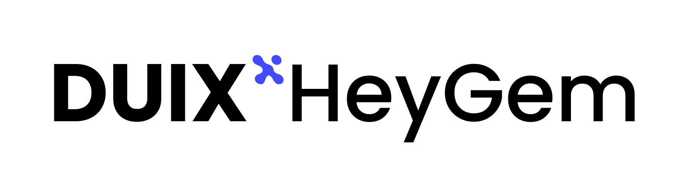
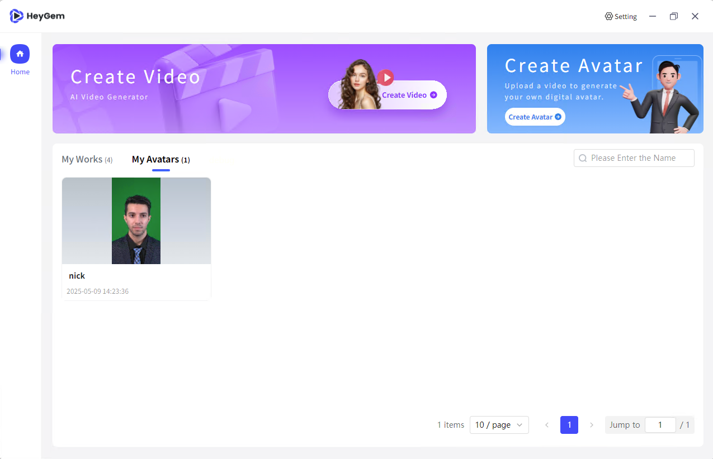

<p align="center">
  
</p>

<h1 align="center">HeyGem - Open Source Alternative to Heygen</h1>
<p align="center"><strong>Created and maintained by Brandon Rezko</strong></p>

---

# Table of Contents

1. [What's HeyGem](#1-whats-heygem)
2. [Introduction](#2-introduction)
3. [How to Run Locally](#3-how-to-run-locally)
4. [Open APIs](#4-open-apis)
5. [What's New](#5-whats-new)
6. [FAQ](#6-faq)
7. [How to Interact in Real Time](#7-how-to-interact-in-real-time)
8. [Contact](#8-contact)
9. [License](#9-license)
10. [Acknowledgments](#10-acknowledgments)
11. [Star History](#11-star-history)

---

## 1. What's HeyGem

**HeyGem** is a free and open-source AI avatar project developed and maintained by **Brandon Rezko**.

The goal of this project is to make digital human technology accessible to everyone. Rather than using costly 3D modeling, HeyGem uses AI to generate realistic avatars from video footage — reducing costs from hundreds of thousands of dollars to less than $1,000. This framework has enabled over 10,000 individuals to create more than 500,000 personalized avatars, helping educators, creators, legal professionals, and businesses scale their video production.

With HeyGem now open-source, anyone can generate AI avatars and create personalized videos entirely offline — for free.

---

## 2. Introduction



**HeyGem** is a fully offline video synthesis tool designed for Windows and Linux systems. It allows users to create realistic digital humans by cloning appearance and voice. No internet connection is required — your data stays private and secure.

### 🔧 Core Features

- **Appearance and Voice Cloning** – Advanced AI generates realistic avatars using facial recognition and speech synthesis.
- **Text and Voice Controls** – Drive avatars using typed scripts or your own recorded voice.
- **High-Quality Sync** – Smooth lip-syncing and audio-video matching.
- **Multi-Language Support** – English, Chinese, Japanese, Korean, Spanish, French, German, and Arabic.

### ✅ Advantages

- Fully offline operation
- User-friendly interface
- Multiple model support with one-click management

---

## 3. How to Run Locally

HeyGem supports Docker-based deployment on both Windows and Ubuntu 22.04.

### 🧱 Dependencies

- Node.js 18
- Docker
- Docker images:
  - `guiji2025/fun-asr`
  - `guiji2025/fish-speech-ziming`
  - `guiji2025/heygem.ai`

---

### 🪟 Windows Installation

#### System Requirements

- Windows 10 (version 19042.1526 or higher)
- C Drive: 100GB+
- D Drive: 30GB+
- NVIDIA GPU with drivers
- Recommended: Intel i5-13400F, 32GB RAM, RTX 4070

#### Steps

1. Install [Docker for Windows](https://www.docker.com/)
2. Ensure WSL is updated:
   ```bash
   wsl --list --verbose
   wsl --update
   ```
3. Navigate to the `/deploy` directory
4. Run:
   ```bash
   docker-compose up -d
   ```
   For lite version:
   ```bash
   docker-compose -f docker-compose-lite.yml up -d
   ```

#### Install Client

1. Download from [Releases](https://github.com/GuijiAI/HeyGem.ai/releases)
2. Run the installer: `HeyGem-x.x.x-setup.exe`

---

### 🐧 Ubuntu 22.04 Installation

#### System Requirements

- Ubuntu 22.04
- 100GB+ disk space
- NVIDIA GPU with drivers

#### Install Docker & Toolkit

```bash
sudo apt update
sudo apt install docker.io docker-compose
```

#### Install NVIDIA Container Toolkit

```bash
distribution=$(. /etc/os-release;echo $ID$VERSION_ID) && \
curl -s -L https://nvidia.github.io/libnvidia-container/gpgkey | sudo apt-key add - && \
curl -s -L https://nvidia.github.io/libnvidia-container/$distribution/libnvidia-container.list | \
sudo tee /etc/apt/sources.list.d/nvidia-container-toolkit.list

sudo apt update
sudo apt install -y nvidia-container-toolkit
sudo nvidia-ctk runtime configure --runtime=docker
sudo systemctl restart docker
```

#### Deploy Server

```bash
cd /deploy
docker-compose -f docker-compose-linux.yml up -d
```

#### Run Client

```bash
chmod +x HeyGem-x.x.x.AppImage
./HeyGem-x.x.x.AppImage --no-sandbox
```

---

## 4. Open APIs

After deployment, local ports expose services accessible via `http://127.0.0.1`.

Refer to:
- `src/main/service/model.js`
- `src/main/service/video.js`
- `src/main/service/voice.js`

### 🗣️ Audio Synthesis

**Endpoint:** `http://127.0.0.1:18180/v1/invoke`

```json
{
  "speaker": "{uuid}",
  "text": "Hello world!",
  "format": "wav",
  "reference_audio": "{voice.asr_format_audio_url}",
  "reference_text": "{voice.reference_audio_text}"
}
```

### 🎥 Video Synthesis

**Endpoint:** `http://127.0.0.1:8383/easy/submit`

```json
{
  "audio_url": "{audioPath}",
  "video_url": "{videoPath}",
  "code": "{uuid}"
}
```

---

## 5. What's New

### ✅ Nvidia 50 Series GPU Support

- Verified support for 5090, CUDA 12.8

### ✅ Ubuntu Version Update

- Client internationalization
- Fixed issues #304 and #292
- Kernel verified: `6.8.0-52-generic`

---

## 6. FAQ

### ✅ Pre-check Before Opening an Issue

1. All Docker services are running.
2. NVIDIA GPU + driver is installed.
3. You are using the latest version.
4. Check [GitHub Issues](https://github.com/GuijiAI/HeyGem.ai/issues)

### ❓ Bug Report Template

1. Describe the issue and reproduction steps.
2. Include screenshots and logs.

---

## 7. How to Interact in Real Time

HeyGem is focused on non-real-time synthesis. Real-time interaction features may be developed in future versions.

---

## 8. Contact

For questions, feedback, or collaboration:

📧 **brandon.rezko.dev@gmail.com**

---

## 9. License

Licensed under the MIT License.  
See [LICENSE](https://github.com/GuijiAI/HeyGem.ai/blob/main/LICENSE) for more info.

---

## 10. Acknowledgments

- ASR powered by **fun-asr**
- TTS powered by **fish-speech-ziming**
- Big thanks to the open-source AI community

---
